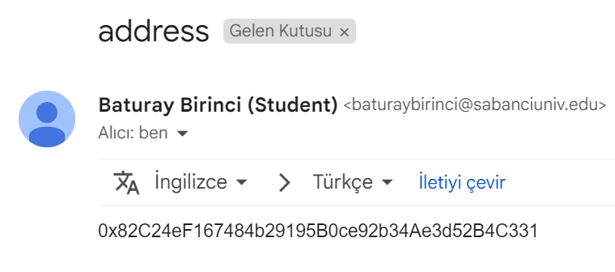

The user needs to send an mail to connect their wallet address with themselves. The email address should be a Sabanci University address, the subject section should only include the word “address” and the body of the mail should only have the waller address. An example mail can be seen below.

